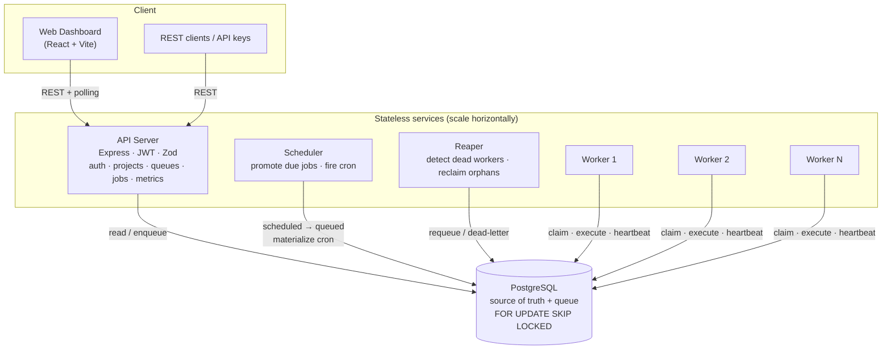
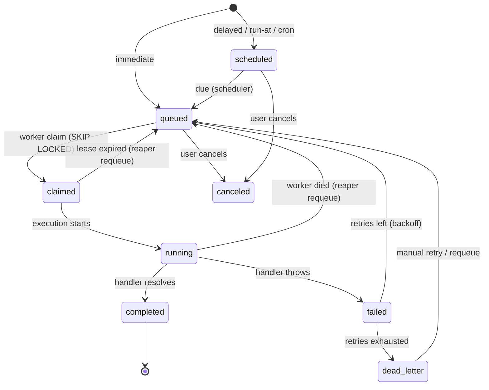

# Architecture

## 1. System overview

The platform is composed of **six components**. Five are stateless and
horizontally scalable; PostgreSQL is the single source of truth **and** the
message queue.



**Why this shape?** The hard part of a distributed scheduler is making sure a
job runs *exactly once* even when many workers poll the same queue and workers
crash mid-run. We solve that inside PostgreSQL rather than with an external
broker — see §4.

### Components

| Component | Responsibility | Scaling |
|-----------|----------------|---------|
| **API Server** | REST API: auth, projects, queues, retry policies, job submission, reads, metrics. Validation, pagination, structured errors. | Stateless — run many behind a load balancer. |
| **Scheduler** | Promotes `scheduled` jobs to `queued` when their time arrives; materializes recurring (cron) definitions into concrete jobs. | Safe to run multiple (row locks). |
| **Worker** | Polls, **atomically claims** jobs, runs the task handler concurrently up to its limit, heartbeats, renews leases, shuts down gracefully. | Add workers to add throughput. |
| **Reaper** | Declares silent workers dead; reclaims their in-flight (orphaned) jobs — requeue if retries remain, else Dead Letter Queue. | Safe to run multiple (SKIP LOCKED). |
| **PostgreSQL** | Durable store for every entity and the queue itself. | Primary + read replicas if needed. |
| **Web Dashboard** | Queue health, job explorer, worker monitor, DLQ, metrics. Live via polling. | Static assets (nginx). |

The backend is **one image** run in four modes (`api` / `scheduler` / `reaper`
/ `worker`), selected by the container command. This keeps shared code (DB
access, job services, retry logic) in one place.

## 2. Job lifecycle (state machine)



- **immediate** jobs start `queued`.
- **delayed / scheduled / recurring** jobs start `scheduled` with a future
  `available_at`; the scheduler flips them to `queued` when due.
- Every attempt is recorded as a `job_executions` row, so **retry history is
  first-class** and visible in the dashboard.

## 3. Key data flows

**Submitting an immediate job**

```
Client → POST /api/queues/:id/jobs → API validates (Zod) → INSERT jobs(status=queued)
```

**A worker claiming and running a job**

```
Worker tick (every POLL_INTERVAL_MS):
  1. free = concurrency − active
  2. claimJobs():  UPDATE … FROM (SELECT … FOR UPDATE SKIP LOCKED LIMIT free)
                   → status=claimed, claimed_by=me, locked_until=now+lease, attempt_count++
  3. for each claimed job (in parallel):
       startExecution()  → status=running, INSERT job_executions(running)
       run task handler  (OUTSIDE any transaction — work can be slow)
       success → completeJob()  status=completed, execution=succeeded
       failure → failJob()      retry (status=queued, available_at=now+backoff)
                                 or dead-letter (status=dead_letter + DLQ row)
  Heartbeat (every HEARTBEAT_INTERVAL_MS): UPDATE workers.last_heartbeat_at,
       extend locked_until on my in-flight jobs (lease renewal).
```

**The reaper recovering from a crash**

```
Reaper tick (every REAPER_INTERVAL_MS):
  markDeadWorkers():  workers with last_heartbeat_at older than
                      HEARTBEAT_TIMEOUT_SECONDS → status=dead
  reclaimOrphans():   jobs in ('claimed','running') where lease expired OR
                      owner is dead → requeue (retries left) or dead-letter
```

## 4. Concurrency model — how exactly-once claiming works

The claim is a single statement:

```sql
WITH claimable AS (
  SELECT j.id
  FROM jobs j JOIN queues q ON q.id = j.queue_id
  WHERE j.status = 'queued'
    AND j.available_at <= now()
    AND q.is_paused = false
    AND (SELECT count(*) FROM jobs r
         WHERE r.queue_id = j.queue_id
           AND r.status IN ('claimed','running')) < q.concurrency_limit
  ORDER BY q.priority DESC, j.priority DESC, j.available_at ASC
  FOR UPDATE OF j SKIP LOCKED          -- ← the magic
  LIMIT $limit
)
UPDATE jobs j
SET status='claimed', claimed_by=$worker, claimed_at=now(),
    locked_until=now() + ($lease||' seconds')::interval,
    attempt_count = attempt_count + 1
FROM claimable c WHERE j.id = c.id
RETURNING j.*;
```

- **`FOR UPDATE`** row-locks each candidate the worker reads.
- **`SKIP LOCKED`** makes a worker *ignore* rows another worker already locked
  instead of blocking on them. Two workers scanning the same queue therefore
  pick **disjoint** sets of jobs — no duplicates, no waiting, no global lock.
- **`locked_until` (lease)** means a crashed worker's claim is not permanent:
  once the lease lapses the reaper can hand the job to someone else.
- **`ORDER BY`** gives queue-priority, then job-priority, then FIFO fairness.

This is verified by `backend/test/claim.test.ts`: 12 workers claim 300 jobs at
once and every job is claimed exactly once.

### Delivery semantics

At-least-once. A job can run more than once if a worker completes the work but
dies before committing the result (the reaper will requeue it). Handlers should
therefore be **idempotent**; the optional `dedupe_key` (a partial unique index)
prevents duplicate *submission* of the same logical job.

## 5. Reliability summary

| Failure | Detection | Recovery |
|---------|-----------|----------|
| Task throws | handler rejects | retry with backoff, then DLQ |
| Worker crashes mid-job | lease (`locked_until`) expires | reaper requeues the job |
| Worker goes silent | heartbeat older than timeout | reaper marks it dead, reclaims its jobs |
| Duplicate submission | `dedupe_key` unique index | second insert rejected (409) |
| Graceful deploy | SIGTERM | worker stops claiming, drains in-flight jobs, then exits |

## 6. Deployment

`docker compose up --build` starts Postgres, runs migrations (one-shot), then
the API, scheduler, reaper, worker(s) and the dashboard. Workers scale
independently (`--scale worker=N`). Any managed Postgres (e.g. Neon) can back a
cloud deployment; the always-on services (worker/scheduler/reaper) need a host
that does not sleep idle processes.
