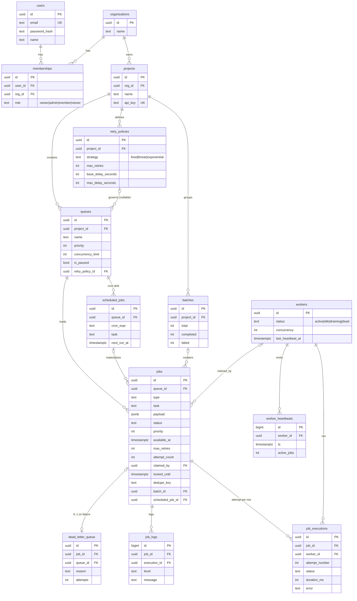

# Entity–Relationship Diagram

The schema is defined in
[`backend/src/db/migrations/001_init.sql`](../backend/src/db/migrations/001_init.sql).

## Diagram

## Tables

| Table | Purpose |
|-------|---------|
| **users** | Accounts (email + bcrypt hash). |
| **organizations** | Tenancy boundary. |
| **memberships** | M:N user↔org, carrying the RBAC `role`. |
| **projects** | Owns queues; has an `api_key` for programmatic submission. |
| **retry_policies** | Reusable backoff config (strategy + delays), project-scoped. |
| **queues** | Priority, concurrency limit, pause flag, optional retry policy. |
| **workers** | Registered worker processes + liveness (`last_heartbeat_at`). |
| **worker_heartbeats** | Append-only heartbeat history for the fleet timeline. |
| **scheduled_jobs** | Recurring **cron definitions**; each firing creates a `jobs` row. |
| **batches** | A named group of jobs with completed/failed counters. |
| **jobs** | The hot table; also the queue. Carries status, priority, availability, lease, attempts. |
| **job_executions** | **One row per attempt** — the retry history. |
| **job_logs** | Structured per-job log lines. |
| **dead_letter_queue** | Jobs that exhausted retries, with the failure reason. |

## Keys & relationships

- **Primary keys**: `UUID` (via `gen_random_uuid()`) on all business tables so
  ids can be generated without central coordination (useful across shards or
  client-side). High-volume append-only logs (`job_logs`,
  `worker_heartbeats`) use `BIGSERIAL` — smaller and monotonic for time-ordered
  inserts.
- **Foreign keys** follow the ownership tree
  `organizations → projects → queues → jobs → {job_executions, job_logs}`.
- **Cardinality highlights**: a job has **many** executions (one per attempt); a
  queue has many jobs; a worker runs many executions; a failed job maps to
  **0..1** DLQ entry.

## Cascading behaviour

- `ON DELETE CASCADE` down the ownership tree: deleting a **project** removes its
  queues, retry policies, batches, and (transitively) all jobs, executions and
  logs — no orphans, no manual cleanup.
- `ON DELETE SET NULL` where the reference is informational rather than
  structural: `queues.retry_policy_id` (queue survives policy deletion and falls
  back to defaults) and `jobs.claimed_by` / `job_executions.worker_id` (history
  survives a worker being removed).

## Indexes (and why)

| Index | Definition | Serves |
|-------|-----------|--------|
| `idx_jobs_claim` | `(queue_id, priority DESC, available_at ASC) WHERE status='queued'` | **The claim query** — a partial index over exactly the runnable rows, pre-ordered so no sort is needed. |
| `idx_jobs_lease` | `(locked_until) WHERE status IN ('claimed','running')` | Reaper finding expired leases. |
| `idx_jobs_pending_schedule` | `(available_at) WHERE status='scheduled'` | Scheduler finding due delayed/scheduled jobs. |
| `idx_jobs_dedupe` | `UNIQUE (queue_id, dedupe_key) WHERE dedupe_key IS NOT NULL AND status NOT IN (...)` | Idempotent submission. |
| `idx_jobs_queue_status` | `(queue_id, status)` | Dashboard status rollups, job explorer filters. |
| `idx_workers_heartbeat` | `(last_heartbeat_at) WHERE status<>'dead'` | Reaper finding silent workers. |
| `idx_scheduled_next` | `(next_run_at) WHERE is_active` | Scheduler finding due cron definitions. |
| `idx_executions_job`, `idx_logs_job`, `idx_heartbeats_worker`, `idx_dlq_queue` | job/attempt, logs, heartbeat and DLQ lookups | Detail views. |

**Partial indexes** are used deliberately: the claim, lease, schedule and
dedupe indexes only cover the small set of rows in a relevant state, so they
stay tiny and hot even when the `jobs` table has millions of completed rows.

## Normalization

The schema is in **3NF**:

- Retry configuration is factored into `retry_policies` (not repeated on every
  queue) and referenced by id — one policy governs many queues.
- **Attempts are separated from jobs** (`job_executions`). A job row holds
  current state; each try is its own row. This removes the repeating group that
  a "retry 1 error / retry 2 error / …" set of columns would create, and makes
  per-attempt worker/duration/error first-class.
- Logs are their own table rather than an array column, so they page and index
  independently of the hot `jobs` row.

## Performance considerations

- The `jobs` row is updated frequently (claim → run → complete). Hot columns
  are narrow (status, timestamps, ids); large/rarely-read data lives in `payload`
  / `result` (`JSONB`) and in child tables.
- The claim index is partial on `status='queued'`, so completed/dead jobs don't
  bloat it; a retention job could archive terminal jobs to keep the table small.
- A `BEFORE UPDATE` trigger maintains `jobs.updated_at` so "last activity"
  ordering needs no application bookkeeping.
